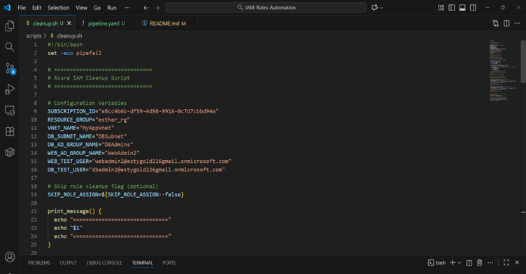
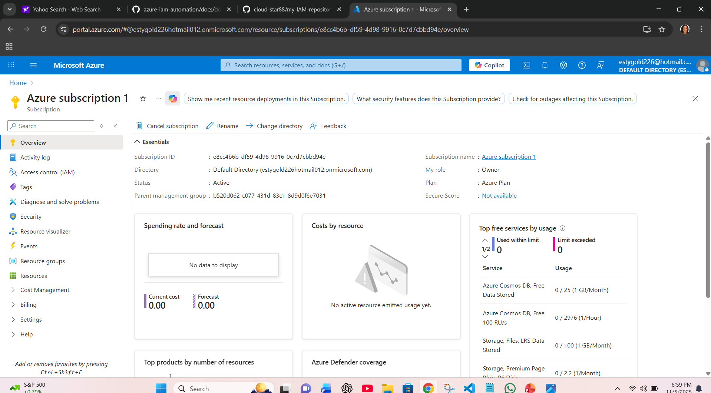
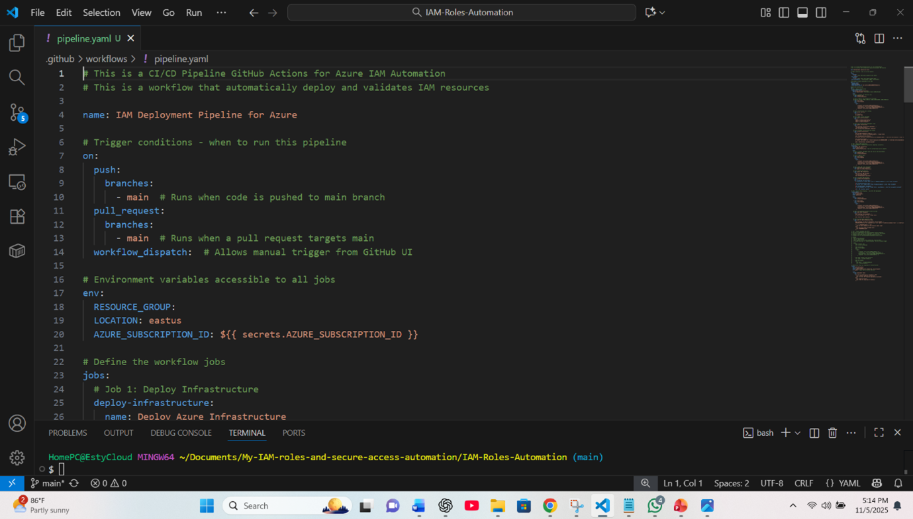
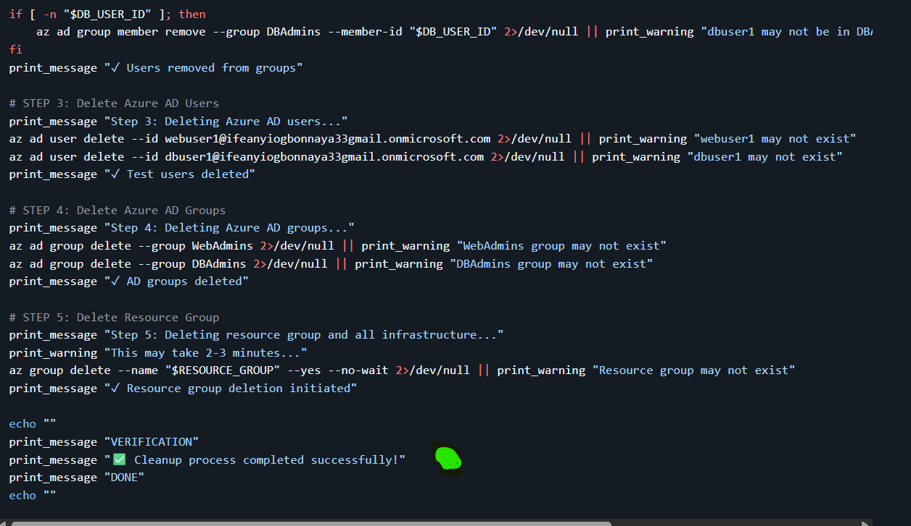

PROJECT GROUP: GROUP 4 
NAME: ESTHER OLUCHI ISRAEL-OLAWEPO
REG. NO: AWS/2025/TC3/057
DATE: 10TH OCTOBER, 2025
TITLE: IAM ROLES AND SECURE ACCESS AUTOMATION 

OBJECTIVE:  Automate the setup of secure identity and access controls using Azure CLI and Bash scripting. 

TASKS:
1.	Create a resource group, virtual network, and subnets (Web and DB).
2.	Create Azure AD groups: ‘WebAdmin’ and ‘DBAdmin’.
3.	Assign Reader role to DBAdmins for DB subnet resources.
4.	Add test users to the AD groups and validate role assignments.

BONUS: Include scripts to revoke access or remove roles for cleanup, also using a CI/CD pipeline to automate the whole process.

My repo link: https://github.com/cloud-star88/my-IAM-repository

 
TASK 1:  Create a resource group, virtual network, and subnets (Web and DB)
1.	I started by creating my folders where my code, dependencies, configurations, architecture, screenshots, deployment and automations steps will be kept.
2.	I created the root folder first, followed by subfolders 
3.	Then I opened my Bash CLI
4.	I opened my Azure GUI on the portal and logged into my account 

Azure login on GUI

5.	I opened my azure account on bash using ‘az login’, after that, my subscription name, ID and other details was displayed.
6.	I typed 1 + ENTER key and my first subscription was selected as default
7.	I am now being logged into my Azure CLI

Azure Login CLI

8.	I entered details in one script for my resource group, virtual network and subnets to be created using the  'az commands’ and other instructions.
9.	When it was created the confirmation and details were listed
10.	The resource group is also shown on CLI and portal
 

Resource Group on CLI

 

Resource Group in Azure portal

11.	After resource group, the next command followed suite within the same script.
12.	Using the following variables with other commands the virtual network was successfully created:  

Virtual network created on CLI

Virtual network created in Azure portal

Subnet created on CLI

 
Subnet created in Azure portal

TASK 2: Create Azure AD groups for WebAdmin and DBAdmin
One the same script, the command for AD group creation ran after the previous command, and the AD Group for WebAdmin and DBAdmin was created.

AD Group for WebAdmin and DBAdmin on CLI

The command 'az ad group list –output table’ was ran on CLI to show the two AD groups are present.
Checking the portal as well confirms the two AD groups are present
 
 
AD Group for WebAdmin and DBAdmin in the portal

Searching for 'Microsoft Entra ID' on the search bar, under management shows two AD Groups.
TASK 3: Assign Reader role to DBAdmins for DBSubnet resources 
The script to assign roll followed on but was not successful, as Bash was unable to process this command despite all credentials made available. 

Image below shows the errors encountered trying to assign DBAdmins for DBSubnet resources.
 
 
 
Role assignment page on CLI

I decided to try Powershell. I created a script named asignrole.ps1 and saved it I used az login to access my account from powershell
 

 
Login to my Azure account from Powershell

 
first error encountered trying to run same command on powershell as used in bash, I corrected it using backward slash.

•	I tried again and another error was flagged, indicating that running script on the system is disabled.
•	I checked for how to rectify it, and I ran the command to install module.
(Install-Module -Name Az -AllowClobber -Scope CurrentUser -Force)

 
Module installed in PowerShell

•	Followed by this to set execution policy
(Set-ExecutionPolicy -ExecutionPolicy RemoteSigned -Scope CurrentUser)
 

Instruction to Set-ExecutionPolicy to allow role assign

•	I ran a command to get my azure subscription ID but saw an error message due to an omission of subscription ID which I added and the system requested I login again and I did and selected my subscription from the list of subscriptions displayed.
•	I ran the following command to get subscription and this time it worked.
(Get-AzSubscription Set-AzContext -SubscriptionId "your-subscription-id")
 
 
PowerShell connected to my Azure account after entering Connect-AzAccount

•	I ran the role assign script on powershell for the last time and the roles for DBAdmin under DBSubnet was successfully assigned.

Script to assign role in PowerShell created

•	The roles was successfully assigned to DBAdmin for DBSubnet

Role name and ID created
•	Role is confirmed on my Azure portal
 

Role is assigned to DBAdmin 

TASK 4: Add test users to the AD groups and validate role assignments.
•	For this task, I created another PowerShell script titled create.user.ps1 and wrote my script into it to perform the required function.
•	I ran the script and there was an error, the error persisted until I decided to separate the script to carry out the separate assignments in the task.
•	I created another script, named it test_users.ps1, adjusted code and ran.
•	I ran them separately and the following are my results.		
 

AD test users for WebAdmin and DBAdmin created
 

 
AD test users for WebAdmin and DBAdmin created the portal

•	I made adjustments to the contents of the second script named test_users.ps1 which is mean to validate role assignments.
•	It ran successfully when I sent the command.
 
 
Getting ID for role assignment

  
test admins added for role assignment
 

 
validation in process

 validation completed
 
 
Validation password displayed

 
 
Validation for DBAdmin user on the portal
 
 
Validation for WebAdmin user on the portal

BONUS: Include scripts to revoke access or remove roles for cleanup, also using a CI/CD pipeline to automate the whole process.
Create file named cleanup.sh on my CLI , it contains the credentials for my Azure resources as variable.

With the variables in place the script was written to carry out the clean up function on the previous resources created.
 
 
cleanup-script-cli
The script was ran, cleanup process started and all resources deleted 

Cleanup-successful

azure-interface-showing-resources-are-deleted

The entire resoures created was sucessfully deleted spep by step as programmed in the script.
The CI/CD was step was the next, I created a file named pipeline.yaml and enterd the command for a workflow that will deploy and validate reources
 
 
ci-cd-script 

cicd-successful

Importance of CI/CD for Project
•	Automation: Streamlined deployments with zero manual intervention.
•	Consistency: Ensures a repeatable and reliable deployment process every time.
•	Validation: Automatically verifies and tests each build before release.
•	Security: Incorporates security scans and audits into the pipeline.
•	Professionalism: Reflects best practices aligned with modern DevOps standards.

Challenge Encountered
Challenge:
Learning how to securely connect GitHub Actions to Azure without revealing credentials within the codebase.
Solution:
I implemented Azure Service Principals together with GitHub Secrets to establish secure, encrypted authentication.
This approach ensures that credentials remain confidential and are never exposed in scripts or logs.

Lessons Learned
•	Gained hands-on understanding of CI/CD pipelines in real DevOps environments.
•	Recognized the value of automated testing and deployment validation.
•	Learned to integrate GitHub Actions seamlessly with Azure for automation.
•	Developed skills in secure credential management using encrypted secrets.
•	Understood the importance of automated security audits in maintaining a robust cloud environment.
Project Summary

Project Deliverables
 Fully automated Azure infrastructure deployment
 Configured IAM with users, groups, and role assignments
 Automated cleanup for complete resource lifecycle management
 CI/CD pipeline for seamless continuous deployment
 Well-documented process with visual proofs and detailed steps

Skills and Competencies Demonstrated
•	Technical Proficiency
•	Azure CLI scripting and automation
•	Bash scripting and workflow orchestration
•	Azure AD and RBAC configuration
•	Infrastructure as Code (IaC) implementation
•	CI/CD pipeline design using GitHub Actions
•	Cloud Security
•	Applied the Principle of Least Privilege
•	Implemented subnet isolation for enhanced network protection
•	Group-based access control for scalability and auditability
•	Automated compliance and security validation
•	DevOps Practices
•	Infrastructure as Code for reproducible environments
•	Automated deployment and teardown workflows
•	Version control and collaboration using Git
•	Clear documentation and standardized code commenting

Security Best Practices Implemented
•	Least Privilege Access
•	DBAdmins assigned Reader roles only
•	Prevented users from modifying subnet resources
•	Network Segmentation
•	Separate subnets for Web and Database tiers
•	Restricted lateral movement to improve isolation
•	Group-Based Role Management
•	Assigned permissions to groups, not individuals
•	Simplified access control and auditing
•	Scalable structure for enterprise environments
•	Automated Compliance
•	Integrated security checks into the CI/CD pipeline
•	Detected excessive permissions automatically
•	Maintained consistent security posture across deployments

Challenges and Solutions
•	Challenge 1: Path Conversion in Git Bash
•	Issue: Resource IDs were auto-converted.
•	Solution: Used export MSYS_NO_PATHCONV=1.
•	Lesson: Path handling differs across shell environments.
•	Challenge 2: Resource Deletion Order
•	Issue: Dependencies prevented resource deletion.
•	Solution: Researched and sequenced deletions properly.
•	Lesson: IAM components must be removed before infrastructure.
•	Challenge 3: Script Idempotency
•	Issue: Concern over rerunning scripts safely.
•	Solution: Verified Azure CLI commands are idempotent.
•	Lesson: Good automation should support repeated runs.
•	Challenge 4: Secure CI/CD Authentication
•	Issue: Protecting Azure credentials in GitHub Actions.
•	Solution: Used Service Principal + GitHub Secrets.
•	Lesson: Credentials must never appear in code or logs.

Real-World Applications
•	Cloud Engineering
•	Automated provisioning and cleanup
•	Efficient resource management
•	Applied IAM and network security best practices
•	DevOps
•	Designed scalable CI/CD workflows
•	Implemented Infrastructure as Code
•	Automated validation and deployment testing
•	Security Operations
•	Enforced RBAC and IAM security controls
•	Conducted access audits and compliance checks
•	Maintained least-privilege access at scale

Future Improvements
•	If expanded, I would:
•	Integrate Terraform for IaC management
•	Add Azure Monitor for real-time alerts
•	Create multi-environment pipelines (Dev, Staging, Prod)
•	Automate backups for configurations
•	Secure secrets with Azure Key Vault
•	Generate compliance reports automatically

Results and Metrics
•	Infrastructure Setup:
•	1 Resource Group, 1 Virtual Network, 2 Subnets
•	Setup Time: 5 mins → 2 mins (automated)
•	IAM Setup:
•	2 Azure AD Groups, 2 Test Users, 1 RBAC Role
•	Setup Time: 10 mins → 3 mins (automated)
•	Automation Impact:
•	70% faster deployments
•	100% configuration consistency
•	Zero human errors
•	Instant cleanup and redeployment

Conclusion
•	This project successfully automated Identity and Access Management (IAM) in Azure, integrating DevSecOps principles for efficiency, security, and scalability.
•	Key Achievements
 Automated infrastructure deployment
 Secure IAM and RBAC configuration
 Lifecycle management with cleanup scripts
 Continuous deployment via CI/CD pipeline
 Comprehensive documentation and validation proofs
•	Technical Expertise Gained
•	Azure automation and scripting
•	AD and RBAC management
•	CI/CD pipeline integration
•	Security-first cloud engineering
•	Impact

This project demonstrates real-world DevOps and Cloud Engineering expertise — merging automation, security, and reliability through IaC, RBAC, and CI/CD integration.

References & Resources
•	Documentation
•	Azure CLI Reference
•	Azure RBAC and IAM Guides
•	Azure Virtual Network Docs
•	GitHub Actions Documentation
•	Bash Scripting Guide
•	Learning Resources
•	Microsoft Learn: Azure Fundamentals
•	Azure Security Best Practices
•	DevSecOps and IaC Methodologies
•	Tools & Technologies
•	Azure CLI v2.40.0+
•	Bash (GNU 5.x)
•	Git & GitHub Actions
•	Visual Studio Code

